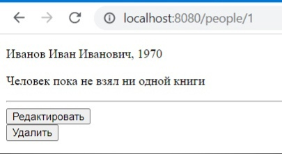

# Задача:
В местной библиотеке хотят перейти на цифровой учет книг. Вам
необходимо реализовать веб-приложение для них. Библиотекари
должны иметь возможность регистрировать читателей, выдавать им
книги и освобождать книги (после того, как читатель возвращает
книгу обратно в библиотеку).

# Сущности:
Человек (поля: ФИО (UNIQUE), год рождения)
Книга (поля: название, автор, год)

Отношение между сущностями: Один ко Многим.
У человека может быть множество книг. Книга может принадлежать
только одному человеку.

В БД должно быть две таблицы - Person и Book. Для всех таблиц
настройте автоматическую генерацию id.
Для этого проекта создайте новую БД с названием project1.

# Необходимый функционал:
 
1. Страницы добавления, изменения и удаления человека.
2. Страницы добавления, изменения и удаления книги

3. Страница со списком всех людей (люди кликабельные - при клике осуществляется
переход на страницу человека).
4. Страница со списком всех книг (книги кликабельные - при клике осуществляется
переход на страницу книги).
5. Страница человека, на которой показаны значения его полей и список книг, которые он
взял. Если человек не взял ни одной книги, вместо списка должен быть текст "Человек
пока не взял ни одной книги".
6. Страница книги, на которой показаны значения полей этой книги и имя человека, 
который взял эту книгу. Если эта книга не была никем взята, должен быть текст "Эта
книга свободна".
7. На странице книги, если книга взята человеком, рядом с его именем должна быть кнопка
"Освободить книгу". Эта кнопка нажимается библиотекарем тогда, когда читатель
возвращает эту книгу обратно в библиотеку. После нажатия на эту кнопку книга снова
становится свободно и пропадает из списка книг человека.
8. На странице книги, если книга свободна, должен быть выпадающий список 
со всеми людьми и кнопка "Назначить книгу". Эта кнопка нажимается библиотекарем
тогда, когда читатель хочет забрать эту книгу домой. После нажатия на эту кнопку, книга
должна начать принадлежать выбранному человеку и должна появится в его списке
книг.
9. Все поля должны валидироваться - с помощью @Valid и Spring Validator, если это
требуется.

## Страницы
### Список всех людей
http://localhost:8080/people

### Добавление нового человека
http://localhost:8080/people/new

### Редактирование данных человека
http://localhost:8080/people/1/edit

### Список всех книг
http://localhost:8080/books

### Добавление новой книги
http://localhost:8080/books/new

### Редактирование данных книги
http://localhost:8080/books/1/edit

### Страница человека
http://localhost:8080/people/1

Без книг

С книгами

### Страница книги
http://localhost:8080/books/1

Свободная

Закрепленная

### При введении невалидных значений

